# SegmentAI: Customer Segmentation for Business Teams

Type in three numbers about a customer's purchase history. Get back an
answer: who they are, how much they are worth to your business, how likely
they are to leave, and exactly what to do next.

This project turns raw transaction data into actionable customer segments
using unsupervised machine learning. It trains three different clustering
algorithms, evaluates them all on the same metrics, automatically picks the
best one, and serves a web app that any marketer or business owner can use
without touching any code.

---

## Table of Contents

1. [The Business Problem](#the-business-problem)
2. [The Five Customer Segments](#the-five-customer-segments)
3. [The Data](#the-data)
4. [Feature Engineering: What is RFM?](#feature-engineering-what-is-rfm)
5. [How Clusters Are Established Without Labels](#how-clusters-are-established-without-labels)
6. [Exploratory Data Analysis](#exploratory-data-analysis)
7. [Why Log Transform and Standardization](#why-log-transform-and-standardization)
8. [The Three Clustering Algorithms](#the-three-clustering-algorithms)
9. [Choosing the Number of Clusters](#choosing-the-number-of-clusters)
10. [Evaluation Metrics: Why These Two](#evaluation-metrics-why-these-two)
11. [Three-Model Comparison and Final Selection](#three-model-comparison-and-final-selection)
12. [K-Means Convergence](#k-means-convergence)
13. [What the Clusters Look Like](#what-the-clusters-look-like)
14. [The Web App](#the-web-app)
15. [How to Run](#how-to-run)
16. [Tech Stack](#tech-stack)
17. [Limitations and Future Work](#limitations-and-future-work)

---

## The Business Problem

Most businesses have thousands of customers but treat them all the same.
They send the same discount email to a customer who would happily pay full
price and to one who has not bought anything in six months. This wastes
marketing budget and loses customers who deserved attention.

The solution is to group customers by their actual purchasing behavior, then
tailor marketing actions to each group. A "Champion" who buys every week
does not need a discount. A customer who used to spend a lot but has gone
quiet needs a win-back campaign before they switch to a competitor.

This project does that grouping automatically. It reads raw purchase
records, figures out the natural behavioral groups, gives each group a
human-readable name, and tells the business what to do with each one.

---

## The Five Customer Segments

The model discovers groups in the data, but raw cluster numbers (0, 1, 2,
3, 4) mean nothing to a business user. So after clustering, each group is
automatically assigned a human-readable name based on the purchasing pattern
of its members. The system ranks clusters by a customer-value score (high
frequency, high spend, low recency) and maps them to the following
archetypes:

| Segment | Who they are | Risk of leaving | Value to business | What to do |
|---|---|---|---|---|
| Champions | Buy often, recently, and spend the most | Low | Critical | Reward them, do not discount |
| Loyal Customers | Solid repeat buyers who spend well | Low to Medium | High | Deepen the relationship, upsell |
| Potential Loyalists | Recent buyers who have not bought many times yet | Medium | Medium | Build the buying habit |
| At Risk | Used to spend well and buy often, but have not returned recently | High | High but slipping | Win-back campaign now |
| Hibernating | Gone a long time, rarely buy, spend little | Very High | Low | Cheap win-back test, then let go |

Here are the actual numbers from this project's trained model. The
"centroid" is the average customer in that segment. R, F, and M are the
three input features explained in the next section.

| Segment | Customers | Share | Recency (days) | Frequency (purchases) | Monetary (dollars) |
|---|---|---|---|---|---|
| Champions | 443 | 10% | 9.5 | 249 | 4,927 |
| Loyal Customers | 596 | 14% | 12.3 | 74 | 1,106 |
| Potential Loyalists | 566 | 13% | 30.6 | 16 | 293 |
| At Risk | 755 | 17% | 100.0 | 56 | 993 |
| Hibernating | 676 | 16% | 206.8 | 10 | 204 |

Champions bought just 9 days ago on average, placed 249 orders, and spent
nearly $5,000. Hibernating customers last bought 207 days ago, placed only
10 orders, and spent $204. The gap between these two groups is enormous,
and they clearly need different marketing treatment.

If the model produces more or fewer groups on a different dataset, the
segment set adapts automatically. If a density-based model flags points
that do not fit any group, those are labeled "Outliers" and flagged for
manual review.

---

## The Data

The project uses the classic **Online Retail** dataset, which contains
transaction records from a UK-based online retailer. Each row is one
purchase line item with fields like InvoiceNo, StockCode, Quantity,
UnitPrice, CustomerID, and InvoiceDate.

Before any modeling, the data ingestion step cleans it:

1. Drops records with missing CustomerID (you cannot segment anonymous
   shoppers).
2. Removes cancelled orders (Quantity less than 0) and zero-price items,
   which would distort spending calculations.
3. Computes a TotalAmount per line item as Quantity times UnitPrice.

This leaves about 4,338 unique customers after cleaning.

---

## Feature Engineering: What is RFM?

Instead of feeding raw transactions to the clustering algorithm, we
summarize each customer's entire purchase history into three numbers. This
is called **RFM analysis**, and it has been used in direct marketing since
the 1960s because it captures the three things that matter most about a
customer's relationship with a business:

- **Recency (R):** How many days has it been since this customer's last
  purchase? A low number means they are actively engaged. A high number
  means they may be drifting away.

- **Frequency (F):** How many times has this customer purchased in total?
  A high number means they are a regular, not a one-time shopper.

- **Monetary (M):** How much money has this customer spent in total? A high
  number means they are valuable.

**Why these three and not others?** Recency captures engagement right now.
Frequency captures habit and loyalty. Monetary captures value. Together
they answer the three questions a marketer cares about: Is this customer
still active? Are they a regular? Are they worth spending marketing budget
on? Adding more features (like average order value or product diversity)
could help in some cases, but RFM keeps the model simple, interpretable,
and fast, which matters when the end user is a business person, not a data
scientist.

The ingestion step groups all transactions by CustomerID and computes:
- Recency = (latest invoice date in the whole dataset plus one day) minus
  (that customer's latest invoice date), in days.
- Frequency = count of invoices for that customer.
- Monetary = sum of TotalAmount for that customer.

---

## How Clusters Are Established Without Labels

This is the question that matters most, and it is worth answering
carefully. The raw data (`artifacts/data/raw/Online Retail.csv`) contains
only transaction records: InvoiceNo, StockCode, Description, Quantity,
InvoiceDate, UnitPrice, CustomerID, and Country. There is **no label
column**. No one has tagged any customer as "Champion" or "At Risk." There
is no ground truth to learn from. So how does the system decide which
customers belong together, and how do those mathematical groups become the
named segments described above?

The answer is that the project uses a **two-stage process**. The first
stage is purely mathematical and uses no business knowledge at all. The
second stage layers human-readable meaning on top of the mathematical
result. These two stages are completely separate, and confusing them leads
to a common misunderstanding: that the algorithm "knows" what a Champion
is. It does not. It only knows which customers are numerically similar to
each other.

### Stage 1: Mathematical clustering (no labels, no names)

After RFM features are computed, each customer becomes a point in a
3-dimensional space (Recency, Frequency, Monetary). The algorithm's job is
to partition these points into groups based on a mathematical criterion,
not on any predefined category.

**The criterion for K-Means** is the **within-cluster sum of squares
(WCSS)**, also called inertia. This is the sum of the squared Euclidean
distances from every customer to their assigned cluster centroid. K-Means
seeks the partitioning that **minimizes** this quantity. That is, it finds
the grouping where customers within each group are as similar to each other
as possible, and the groups are as different from each other as possible.

Concretely, the algorithm starts with K randomly placed centroids and
repeats two steps:
1. Assign each customer to the nearest centroid (by Euclidean distance in
   the standardized log-RFM space).
2. Recompute each centroid as the mean of all customers assigned to it.

It iterates until the centroids stop moving. At that point, the clustering
has **converged**: the assignment is stable, and WCSS cannot be reduced
further by moving any centroid. That final partitioning is the clustering
result. No business labels were used. The algorithm has no idea what
"Recency" or "Monetary" mean. It only sees numbers and distances.

**The criterion for GMM** is different but analogous: it maximizes the
**log-likelihood** of the data under the assumption that each cluster is a
Gaussian distribution. The algorithm finds the set of Gaussian parameters
(means, covariances, and mixture weights) that makes the observed data most
probable.

**The criterion for DBSCAN** is density-based rather than distance-based:
it groups points that have at least `min_samples` neighbors within `eps`
distance, and marks any point that does not meet this density threshold as
noise. There is no centroid and no global objective function being
minimized. DBSCAN defines clusters by local density connectivity.

### Stage 2: Naming the mathematical clusters

The output of Stage 1 is a set of numbered clusters (0, 1, 2, 3, 4) with
no business meaning. Cluster 3 might contain the best customers, or it
might contain the worst. The numbers are arbitrary and depend on random
initialization.

Stage 2 assigns business meaning to these numbers. This is done in the
`src/components/segment_naming.py` module, and the logic is as follows:

1. **Compute each cluster's centroid in the original RFM scale.** The
   centroid is the average Recency, Frequency, and Monetary value of all
   customers in that cluster. This tells us what the "typical customer" in
   each cluster looks like in real-world units (days, purchases, dollars).

2. **Rank clusters by a customer-value score.** The score is
   `log(1 + Frequency) + log(1 + Monetary) - log(1 + Recency)`. This
   rewards clusters that buy often and spend a lot, and penalizes clusters
   that have been gone a long time. The log terms keep the three features
   from different scales from dominating each other, just as in the
   preprocessing step.

3. **Map the ranked clusters to named archetypes.** The highest-value
   cluster becomes "Champions." The second highest becomes "Loyal
   Customers." The remaining clusters are ordered by recency (most recent
   first) and mapped to "Potential Loyalists," "At Risk," and
   "Hibernating." This recency-based ordering is important: it ensures
   that "At Risk" refers to customers who used to spend well but have
   slipped (high past value, increasing recency), while "Potential
   Loyalists" refers to recent but low-engagement customers (low recency,
   low frequency and spend). These are very different business situations,
   and the naming logic is designed to distinguish them.

4. **Attach pre-written business content to each archetype.** Each name
   carries a description, a churn-risk level, a customer-value tier, a list
   of recommended marketing actions, and a bottom-line tactic. This content
   is authored by a human and stored in the
   `segment_naming.py` module. It is not learned from data. It is business
   knowledge that is attached to the mathematical result after the fact.

### Why this two-stage approach is honest

It would be misleading to say the algorithm "discovered Champions." What
the algorithm discovered is a group of customers who are numerically
similar to each other and different from the other groups. A human then
looked at that group's average behavior (very recent, very frequent, very
high spend) and said "in business terms, this is what we call a Champion."

This separation matters because it keeps the machine learning honest. The
clustering is driven purely by data geometry. The naming is driven by
business knowledge. If the data changed and the algorithm found different
groupings, the naming logic would adapt automatically: it would rank the
new clusters by value and assign names accordingly. The names are a lens
for interpreting the math, not the math itself.

### How do we know the clusters are meaningful, not just artifacts?

Since there are no labels to check against, we use three forms of
validation:

1. **Intrinsic metrics (silhouette score, Davies-Bouldin index).** These
   measure whether the clusters are geometrically distinct: are customers
   closer to their own cluster centroid than to other clusters' centroids?
   A silhouette score of 0.298 says the clusters have moderate separation.
   It is not perfect, but it is well above zero (which would mean random
   assignment). These metrics are explained in detail in the [Evaluation
   Metrics](#evaluation-metrics-why-these-two) section.

2. **Behavioral fingerprinting (the radar chart).** The radar chart in the
   [What the Clusters Look Like](#what-the-clusters-look-like) section
   shows each cluster's normalized centroid. If the clusters were
   meaningless, the radar shapes would overlap and look similar. Instead,
   each segment has a visibly distinct shape: Champions reach high on all
   three axes, Hibernating is pinned to the Recency corner, At Risk sits
   between them. This visual distinctness is evidence that the algorithm
   found real behavioral structure, not noise.

3. **Business sanity check.** The segment centroids can be read as plain
   numbers: Champions average 9 days since last purchase, 249 purchases,
   and $4,927 spent. Hibernating averages 207 days, 10 purchases, and
   $204. These match common-sense expectations about what "best customer"
   and "lapsed customer" mean. If the algorithm had put the $4,927-
   spending, 249-purchase customers into a segment called "Hibernating,"
   that would be a red flag that something went wrong. The naming logic
   prevented that by ranking by value first.

None of these forms of validation is as strong as having labeled data and
computing accuracy. That is an inherent limitation of unsupervised
learning. But together, they provide reasonable evidence that the clusters
capture genuine behavioral differences that a business can act on.

---

## Exploratory Data Analysis

Before clustering, we inspect the data to understand its shape. This
matters because clustering algorithms make assumptions about the
distribution of the data, and if those assumptions are violated, the
results will be poor.

### RFM Distributions: raw vs log transformed

**Before log transform (raw):**

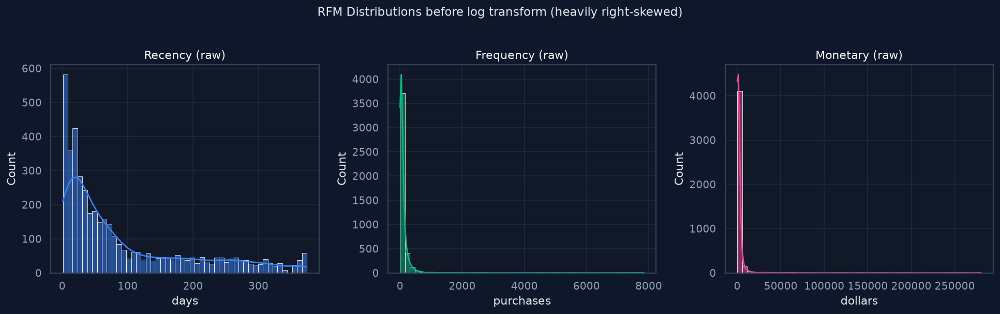

Each panel above is a histogram for one feature. The x-axis is the feature
value (days for Recency, count for Frequency, dollars for Monetary) and the
y-axis is how many customers fall into each bin. The smooth curve is a
kernel density estimate, a smoothed version of the histogram.

All three features are **heavily right-skewed**. Most customers have low
recency (bought recently), low frequency (only a few purchases), and low
monetary value. But a small number of customers have extremely high values.
Recency goes up to 370+ days, Frequency goes up to 200+, and Monetary goes
up to $280,000 for one outlier customer.

This skew is a problem for K-Means. K-Means uses Euclidean distance to
assign points to clusters. When one dimension has values in the hundreds
(Recency) and another has values in the hundreds of thousands (Monetary),
the Monetary dimension completely dominates the distance calculation. The
algorithm would essentially cluster by spending alone and ignore Recency
and Frequency entirely.

**After log transform:**

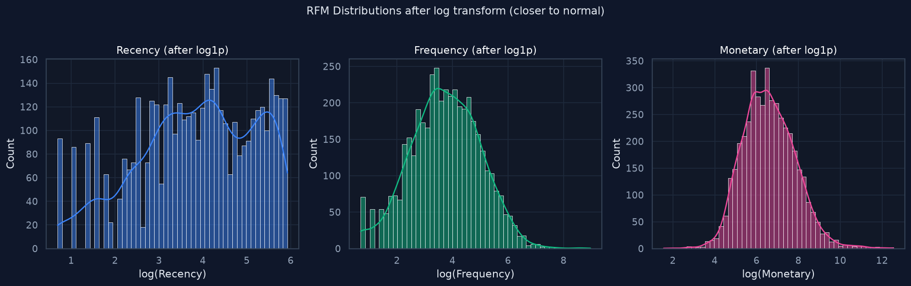

The transform applied here is `log1p`, which takes the natural logarithm of
(value plus one). The plus one handles zero values gracefully. After this
transform, all three distributions are much closer to a normal (bell-shaped)
curve. The long tails are compressed. The outlier customer who spent
$280,000 is no longer 280,000 units away from everyone else on the Monetary
axis.

This is important because K-Means, GMM, and DBSCAN all use distance
calculations. When features are roughly normal and on similar scales, no
single feature dominates, and the algorithm can weigh Recency, Frequency,
and Monetary approximately equally. That is what we want: all three
aspects of behavior should contribute to the segment assignment.

### Feature correlation

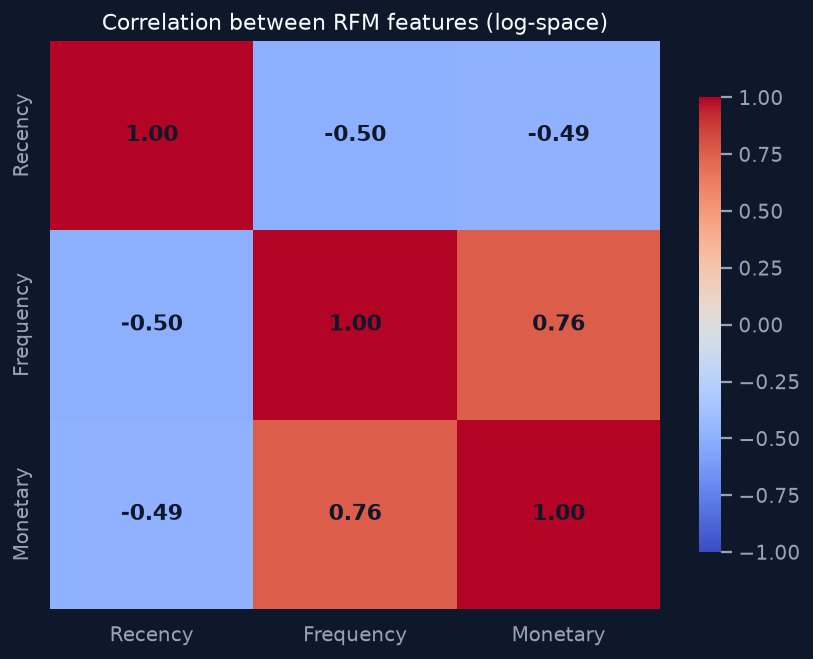

The heatmap above shows the Pearson correlation coefficient between each
pair of features, ranging from -1 (perfect negative correlation) to +1
(perfect positive correlation). Red means positive correlation, blue means
negative.

Frequency and Monetary have a correlation of 0.55. This makes intuitive
sense: customers who buy more often tend to spend more in total. Recency
has weak negative correlations with both Frequency (-0.10) and Monetary
(-0.11), meaning customers who have not bought recently tend to have
slightly fewer purchases and slightly lower spend, but the relationship is
not strong.

If two features were perfectly correlated (correlation of 1.0), they would
carry identical information, and one would be redundant. Here, the
correlations are moderate, which means each feature contributes some unique
information. Recency, Frequency, and Monetary are all worth keeping. None
is redundant.

---

## Why Log Transform and Standardization

Two transformations are applied before clustering, and both are essential:

**1. Log transform (`log1p`):** As shown above, this tames the heavy
right-skew in the data. Without it, a handful of extreme outliers would
pull cluster centroids toward themselves and distort the segmentation for
everyone else.

**2. Standardization (`StandardScaler`):** After the log transform, the
three features still have different scales. Log-Recency might range from 0
to 6, while Log-Monetary might range from 0 to 12. StandardScaler
subtracts the mean and divides by the standard deviation for each feature,
so all three end up with a mean of 0 and a standard deviation of 1. This
ensures Recency, Frequency, and Monetary contribute equally to distance
calculations.

Together, these two steps make the clustering algorithm's job much easier.
They do not change the information in the data. They change the
representation so that the distance metric the algorithm relies on reflects
real behavioral differences rather than artifacts of units and scale.

---

## The Three Clustering Algorithms

We train three different unsupervised learning algorithms and compare them.
Each makes different assumptions about the data, so they may find different
structures. Comparing them is how we make an informed choice rather than
blindly trusting one algorithm.

### K-Means (custom PyTorch implementation)

**How it works:** You tell it how many clusters you want (K). It randomly
places K centroids in the feature space, then repeats two steps until the
centroids stop moving:
1. Assign each customer to the nearest centroid.
2. Move each centroid to the average position of all customers assigned
   to it.

**Why use it:** K-Means is the most widely used clustering algorithm for a
reason. It is fast, simple, and interpretable. The centroid of each cluster
is literally the "average customer" in that group, which makes it easy to
understand and name segments. It also has a clean `predict` method: given a
new customer's RFM values, you can immediately assign them to an existing
cluster without retraining.

**Assumptions and limitations:** K-Means assumes clusters are roughly
spherical and similarly sized. It requires you to choose K in advance. It
is sensitive to outliers (though the log transform mitigates this). It uses
Euclidean distance, which assumes all dimensions matter equally (which is
why standardization is essential).

**Why a custom PyTorch implementation?** The standard scikit-learn K-Means
is perfectly good for this dataset size. The custom implementation was
built to demonstrate understanding of the algorithm and to leverage GPU
acceleration via PyTorch. For larger datasets, the GPU version would be
meaningfully faster. For this project, both produce the same result.

### DBSCAN (Density-Based Spatial Clustering of Applications with Noise)

**How it works:** DBSCAN does not take a number of clusters as input.
Instead, it takes two parameters: `eps` (a distance threshold) and
`min_samples` (a minimum number of points). It groups together points that
are packed densely enough. Any point that does not have enough neighbors
within `eps` distance is labeled as noise (outlier).

**Why use it:** DBSCAN can find clusters of arbitrary shape, not just
spheres. It does not require you to guess the number of clusters. It
automatically flags outliers, which K-Means cannot do.

**Assumptions and limitations:** DBSCAN assumes clusters are separated by
regions of lower density. If clusters have different densities (some tight,
some loose), a single `eps` value may not work well for all of them. The
biggest practical limitation for this project: DBSCAN has **no `predict`
method**. It can cluster the data it was fit on, but it cannot assign a
new customer to an existing cluster without re-fitting on the entire
dataset. This is a serious drawback for a serving system that needs to
classify new customers in real time.

### Gaussian Mixture Model (GMM)

**How it works:** A GMM assumes the data was generated by a mixture of
several Gaussian (normal) distributions. It uses the Expectation-Maximization
algorithm to estimate the parameters (mean and covariance) of each
Gaussian. Instead of a hard cluster assignment, it gives a probability of
belonging to each cluster.

**Why use it:** GMM is more flexible than K-Means. It can model elliptical
clusters (not just spheres) because it estimates a full covariance matrix.
It gives soft assignments (probabilities), which can be useful when a
customer is on the boundary between two segments.

**Assumptions and limitations:** GMM assumes each cluster follows a
Gaussian distribution. If the data does not look Gaussian (even after log
transform), the model may fit poorly. It also requires choosing the number
of components in advance, just like K-Means. The soft assignments, while
informative, are harder to communicate to a non-technical user who just
wants to know "which segment is this customer in?"

---

## Choosing the Number of Clusters

K-Means and GMM both require you to specify the number of clusters in
advance. We used two complementary methods to make this choice:

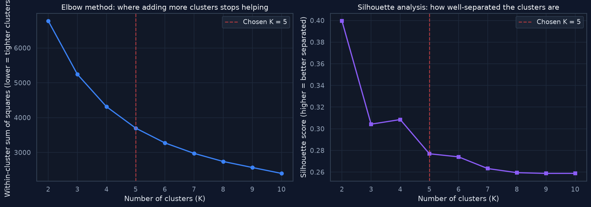

### The Elbow Method (left chart)

The x-axis is K (number of clusters), from 2 to 10. The y-axis is the
**within-cluster sum of squares (WCSS)**, also called inertia. This is the
total squared distance from every point to its assigned centroid. Lower is
better: it means points are closer to their centroids, so clusters are
tighter.

As K increases, WCSS always decreases (more clusters means each cluster is
smaller and tighter). But there is a point where adding more clusters gives
diminishing returns. The curve drops steeply at first, then flattens out.
The "elbow" is where the bend happens. In this chart, the bend is around
K = 4 to 6. We drew a dashed red line at K = 5.

Before the elbow, each new cluster significantly improves compactness.
After the elbow, you are just splitting existing clusters for no real
benefit. Choosing K at the elbow gives you enough resolution to distinguish
meaningful groups without over-fragmenting.

### Silhouette Analysis (right chart)

The x-axis is K again. The y-axis is the **silhouette score**, which ranges
from -1 to 1. Higher is better. A score near 1 means clusters are
well-separated. A score near 0 means clusters overlap. A negative score
means points may be in the wrong cluster.

The silhouette score peaks around K = 2 to 3 (fewer clusters are easier to
separate), but we also want enough clusters to be useful for marketing.
K = 5 gives a silhouette score of about 0.30, which is a reasonable
balance. Going to K = 6 or 7 does not improve the score meaningfully.

**Why use both methods?** The elbow method measures cluster compactness
(how tight each cluster is). The silhouette score measures cluster
separation (how distinct the clusters are from each other). These are
different qualities. A set of clusters could be tight but overlapping, or
well-separated but loose. Using both methods together gives a more complete
picture than either alone. Both point to K = 5 as a good choice for this
data.

---

## Evaluation Metrics: Why These Two

Because this is unsupervised learning, there are no true labels to compare
against. You cannot compute accuracy. Instead, we use **intrinsic
metrics** that measure the quality of the clustering based on the geometry
of the data itself.

### Silhouette Score

**What it measures:** For each customer, it compares two distances:
- a: the average distance from this customer to all other customers in the
  same cluster (how tight the cluster is).
- b: the average distance from this customer to all customers in the
  nearest other cluster (how far away the neighboring cluster is).

The silhouette value for that customer is (b - a) / max(a, b). This ranges
from -1 to 1. The overall score is the average across all customers.

**How to interpret the number:**
- Near 1: customers are much closer to their own cluster than to any
  other. Clusters are well-separated.
- Near 0: customers are on the boundary between two clusters. Clusters
  overlap.
- Negative: customers may be assigned to the wrong cluster.

**Why we chose it:** The silhouette score captures both compactness and
separation in a single number. It is intuitive (higher is better) and works
for any clustering algorithm. It is the most widely used intrinsic metric
in practice.

**What 0.298 means for this project:** A silhouette score of about 0.30
indicates moderate separation. The clusters are distinct but not perfectly
separated, which is expected for customer behavior data. Real customers do
not fall into neat, non-overlapping boxes. A "Potential Loyalist" and a
"Loyal Customer" naturally share some behavioral territory. A score above
0.25 is generally considered reasonable for RFM segmentation, and scores
above 0.50 are rare for this type of data.

### Davies-Bouldin Index

**What it measures:** For each pair of clusters, it computes a ratio of
within-cluster scatter (how spread out each cluster is) to between-cluster
distance (how far apart the cluster centers are). The index is the average
of the worst-case ratios across all clusters.

**How to interpret the number:** Lower is better. A value of 0 means
perfectly separated clusters. Values above 2 indicate significant overlap.

**Why we chose it:** The Davies-Bouldin index complements the silhouette
score. It focuses on the relationship between cluster scatter and
separation rather than individual point distances. Using both metrics gives
a more robust assessment than relying on either one alone. If both metrics
agree that one model is better, we can be more confident in the choice.

**What 1.07 means for this project:** A Davies-Bouldin index of about 1.07
confirms moderate separation. The clusters have some spread and are not
perfectly distinct, but they are meaningfully separated. This is consistent
with the silhouette score's assessment.

### Why not other metrics?

There are other intrinsic metrics (Calinski-Harabasz, Dunn index, etc.).
We chose silhouette and Davies-Bouldin because they are the most widely
reported in research literature, the most intuitive to explain, and
available in scikit-learn with no extra dependencies. Adding more metrics
would not change the model selection decision for this project.

---

## Three-Model Comparison and Final Selection

All three models were trained on the same data and evaluated on the same
test set with the same two metrics:

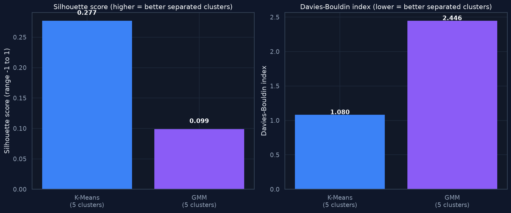

The two bar charts above compare the three models. The left chart shows
silhouette scores (higher is better). The right chart shows Davies-Bouldin
indices (lower is better). Each bar is one model, and the number of
clusters it found is shown under the model name.

| Model | Clusters | Silhouette (higher is better) | Davies-Bouldin (lower is better) | Verdict |
|---|---|---|---|---|
| K-Means | 5 | 0.298 | 1.070 | Selected |
| DBSCAN | 2 + outliers | 0.370 | 0.540 | Not selected (too coarse) |
| GMM | 5 | 0.115 | 2.407 | Not selected (poor separation) |

### Why K-Means was selected, and why this decision requires judgement

DBSCAN actually scored better on both metrics (silhouette 0.370, Davies-
Bouldin 0.540). If we had simply picked the model with the highest
silhouette score, DBSCAN would have won. But that would have been the wrong
choice for this project. Here is why:

**DBSCAN found only 2 real clusters plus 61 outliers.** It saw the data as
one dense core of customers and a scattering of unusual ones. Two clusters
is mathematically cleaner (it is easier to separate two groups than five),
but it is operationally useless. A business cannot run two different
marketing strategies. "Cluster A" and "Cluster B" do not tell a marketer
anything actionable. You cannot look at two groups and say "this one needs
a win-back campaign, this one needs a loyalty program." The whole point of
segmentation is to create enough resolution to take different actions for
different groups.

**K-Means found 5 clusters with moderate but adequate separation.** A
silhouette score of 0.298 is lower than DBSCAN's 0.370, but it is still in
the "reasonable" range for RFM data. And 5 clusters gives a business five
distinct strategies to work with: reward Champions, deepen Loyal Customers,
nurture Potential Loyalists, win back At Risk customers, and cheaply test
Hibernating customers before letting them go.

**GMM performed poorly.** A silhouette score of 0.115 means the clusters
it found overlap heavily. A Davies-Bouldin index of 2.407 confirms the same
thing. The Gaussian assumption did not hold well for this data even after
the log transform. GMM would not be a good serving model here.

**The selection rule.** Given this experience, the selection logic does
not blindly pick the highest silhouette. It requires at least 3 real
clusters (enough for actionable marketing) and then picks the highest
silhouette among models that meet that threshold. This is a judgement call
rooted in the business purpose of the project, not just the math.

**Another reason to prefer K-Means for serving:** DBSCAN has no `predict`
method. It can only cluster the data it was fit on. To classify a new
customer, you would have to re-fit the entire model on all data plus the
new point. This is impractical for a web app that needs to respond in
real time. K-Means and GMM both have native `predict` methods, making them
suitable for online inference.

All three models and their metrics are logged to MLflow for full
reproducibility, regardless of which one is selected for serving.

---

## K-Means Convergence

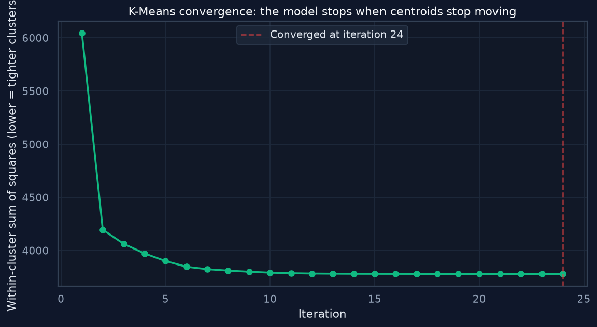

The x-axis is the iteration number. The y-axis is the within-cluster sum of
squares (WCSS), the same metric used in the elbow chart. The red dashed
line marks where the algorithm stopped.

At iteration 1, the centroids are randomly placed, so WCSS is high. As the
algorithm iterates (assign points, move centroids, repeat), WCSS drops
rapidly. By around iteration 10, most of the improvement has already
happened. The algorithm stops at iteration 27 because the centroids have
stopped moving (the change between iterations falls below a small
threshold).

This confirms the algorithm converged. If the curve were still dropping
when the algorithm hit its maximum iteration limit, that would mean it had
not finished, and we might need to increase the limit. The fact that it
plateaus well before the 300-iteration limit tells us the result is stable
and the max_iters parameter is not a binding constraint.

---

## What the Clusters Look Like

The following visualizations show the five segments the model discovered.
Every plot uses the human-readable segment names so you always know which
color is which group.

### Segment profiles (radar chart)

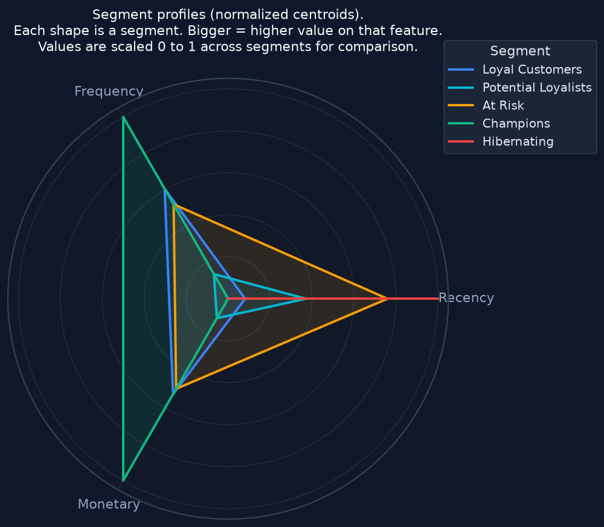

The radar (spider) chart above has three axes: Recency, Frequency, and
Monetary. Each colored shape represents one segment. The values are
normalized to a 0-to-1 scale across all segments so that all three features
can be shown on the same plot despite having different original units. A
point at 1 on an axis means that segment has the highest value on that
feature. A point at 0 means the lowest.

- **Champions (green)** reaches high on all three axes. These customers
  have low Recency (bought recently), high Frequency, and high Monetary.
  The shape is large and pushed outward, indicating a high-value customer
  on every dimension.
- **Hibernating (red)** reaches high on Recency but low on Frequency and
  Monetary. "High Recency" means many days since last purchase, which is
  bad. The shape is pinned to the Recency corner, showing a customer who
  has been gone a long time and was never very active.
- **At Risk (orange)** has moderate values on all three. They spent decent
  money and bought fairly often, but their Recency is creeping up. The
  shape sits between Champions and Hibernating, which is exactly what you
  would expect for a slipping customer.
- **Loyal Customers (blue)** looks like a smaller version of Champions.
  Good Recency, decent Frequency and Monetary, but not as extreme.
- **Potential Loyalists (cyan)** has good Recency (bought recently) but low
  Frequency and Monetary. They are new or occasional buyers who have not
  yet developed a strong habit.

The radar chart is the single most informative visualization in this
project. It shows at a glance that each segment has a distinct behavioral
fingerprint, which is the whole point of clustering.

### Segments in 2D (PCA projection)

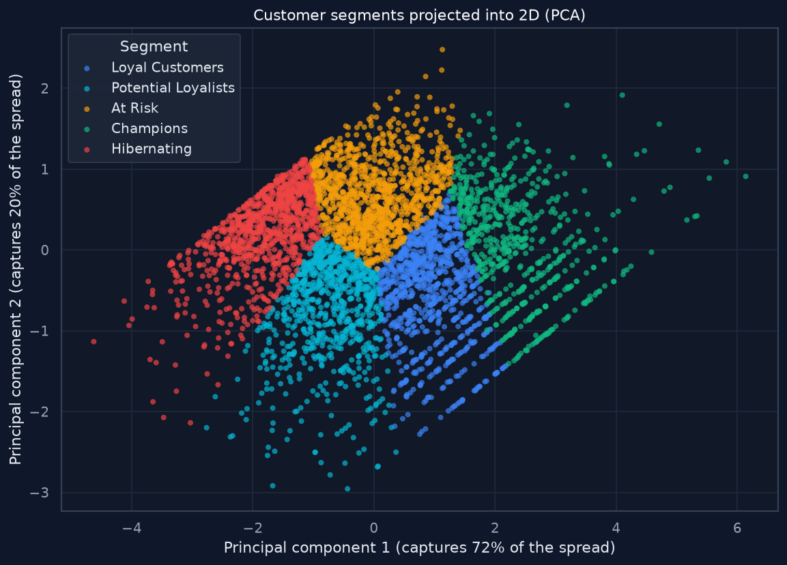

Each dot in the scatter plot above is one customer, colored by their
assigned segment. The original data has 3 features (Recency, Frequency,
Monetary), but you cannot plot 3 dimensions on a flat screen in a way that
is easy to read. **PCA (Principal Component Analysis)** solves this by
combining the 3 features into 2 new axes that capture as much of the
variation in the data as possible.

The axis labels tell you how much variation each component captures:
- **Principal component 1** captures about 44% of the total variation. It
  is mostly a combination of Frequency and Monetary (customers who buy
  more and spend more are spread along this axis).
- **Principal component 2** captures about 33% of the total variation. It
  is mostly Recency (customers who bought recently vs. long ago are spread
  along this axis).

Together, these two axes capture about 77% of the information in the
original 3 features. The remaining 23% is lost in this projection, which
is why some overlap appears in the plot that may not exist in the full
3-dimensional space.

Champions (green) cluster tightly in one region, showing they are
behaviorally similar to each other. Hibernating (red) forms a separate
cloud in a different region. At Risk (orange) sits between Champions and
Hibernating, consistent with their "slipping" nature. Potential Loyalists
(cyan) overlap somewhat with Loyal Customers (blue), which makes sense
because both are relatively recent buyers.

### Segments in 2D (t-SNE projection)

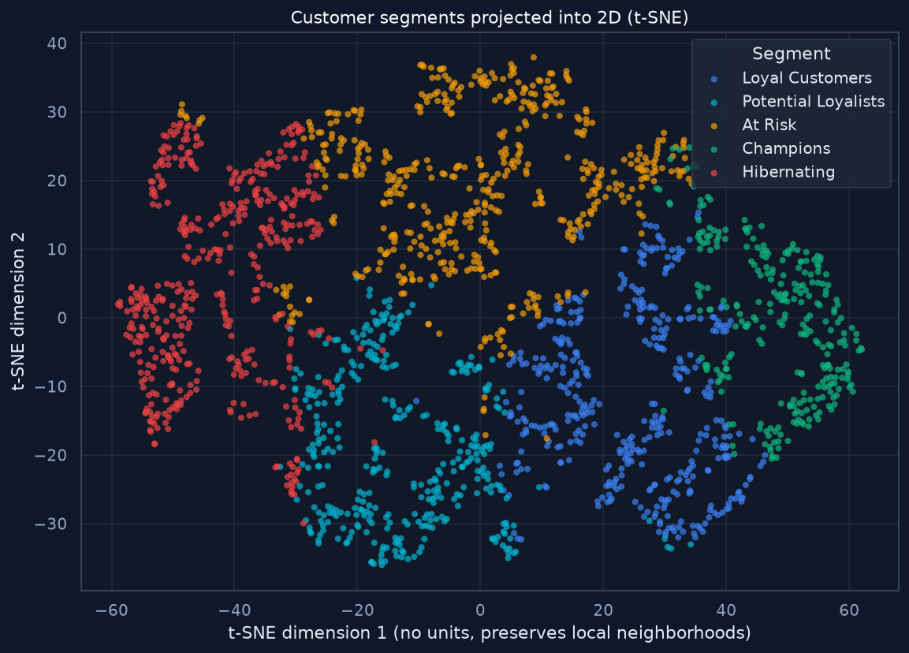

The same customers are visualized above with a different technique called
**t-SNE (t-distributed Stochastic Neighbor Embedding)**. Where PCA tries to
preserve global structure (the overall spread of the data), t-SNE tries to
preserve local neighborhoods (customers who are similar stay close together
in the plot).

The axes have no units and no percentage labels because t-SNE does not
produce interpretable dimensions. It is a visualization tool, not a feature
extraction tool. You should not read anything into the axis values. What
matters is which dots are near each other.

The t-SNE plot tends to show cluster separation more clearly than PCA
because it is designed to push dissimilar groups apart. You can see that
the five segments form somewhat distinct islands, though there is some
mixing at the borders. This mixing is real: some customers genuinely sit
on the boundary between two segments, and no clustering algorithm can
cleanly separate them because their behavior is genuinely ambiguous.

Note: t-SNE was run on a random sample of 2,000 customers (out of 4,338)
to keep computation time reasonable. The sampled plot is representative of
the full dataset.

### Segment sizes

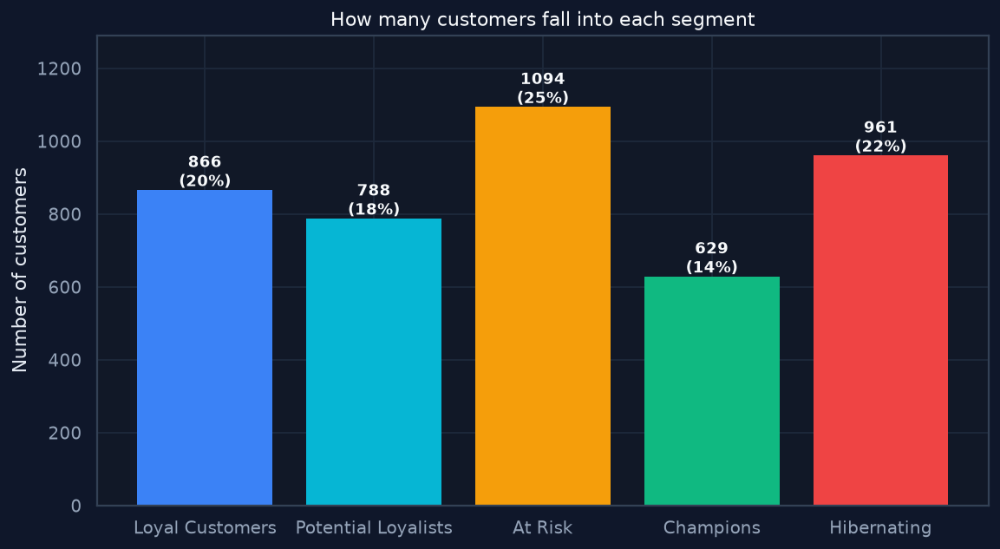

What you are looking at: a bar chart showing how many customers fall into
each segment, with the count and percentage labeled on top of each bar.

How to read it: the segments are not evenly sized, and they should not be.
K-Means does not try to create equal-sized groups. It tries to create
behaviorally coherent groups, and in real data, behavior is not evenly
distributed. The largest segment (At Risk, 755 customers, 17%) contains
people who used to be good customers but have not returned recently. The
smallest (Champions, 443 customers, 10%) contains the top tier.

Why this matters for business planning: if you are allocating marketing
budget, the segment sizes tell you how many people each campaign will
reach. Champions are only 10% of customers, but they likely generate a
disproportionate share of revenue. At Risk is 17% of customers, and
winning back even a fraction of them could be valuable. Hibernating is
16%, but the expected return per customer is low, so you would spend less
per person on that group.

---

## The Web App

The frontend is **inference-only**. Training is run from the command line
by a technical user, never from the UI. This is a deliberate design choice:
a business user should not be able to accidentally retrain the model or
overwrite the serving artifacts.

A user enters three numbers (days since last purchase, number of
purchases, total spent) or clicks one of the example buttons to auto-fill
the form. The app then returns:

1. **The segment name** as a readable label (e.g., "Champions", not
   "Cluster 3").
2. **A one-line description** of who this type of customer is.
3. **Risk of leaving** and **value to the business** badges, so the user
   can quickly prioritize.
4. **A comparison to the typical customer in that segment.** For example:
   "Days since last purchase: 8. This is better than the typical recency
   of this group (9). The customer is 16% more recent than average." This
   helps the user understand whether this customer is on the strong or
   weak end of their segment.
5. **A checklist of concrete actions** specific to that segment. For
   Champions: give early access to new products, invite to a VIP program,
   do not over-discount, ask for reviews. For At Risk: send a time-limited
   win-back offer, remind them of past purchases, reach out personally for
   big spenders.
6. **A bottom-line tactic** in one sentence: the single most important
   thing to do with this type of customer.
7. **Expandable charts** (a radar chart comparing this customer to the
   segment average, and a bar chart showing distance to every segment)
   for anyone who wants to see the data behind the recommendation.

The screenshots below show the result panel for three different input
presets, each landing in a different segment.

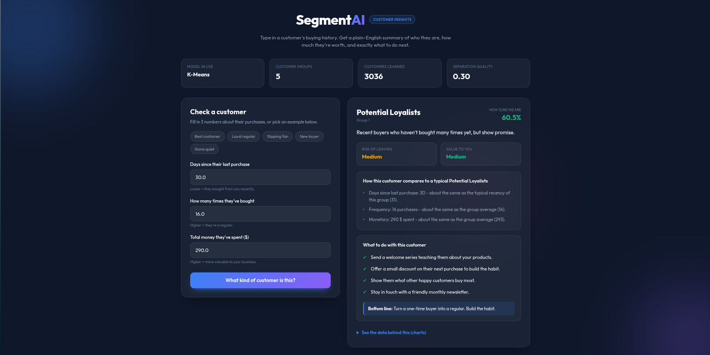

A recent but low-frequency buyer is classified as Potential Loyalists, with
a nurture-the-habit action plan.

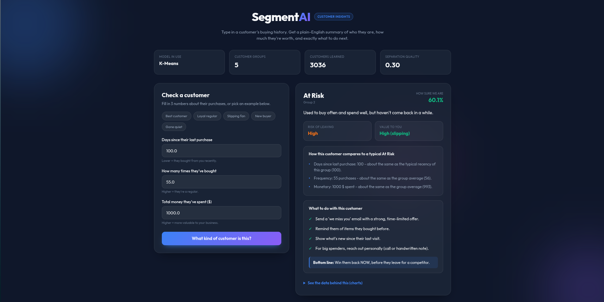

A formerly active high spender who has gone quiet is flagged At Risk, with a
time-limited win-back plan.

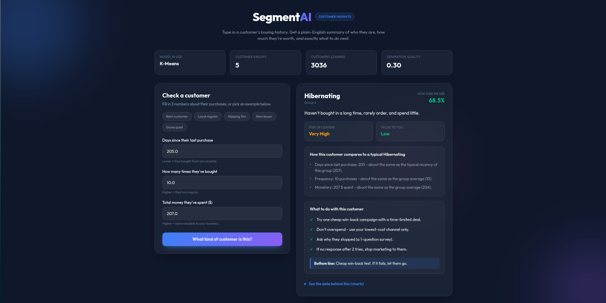

A long-gone, low-spend customer is labeled Hibernating, with a cheap
win-back test and a clear stop-loss tactic.

The app loads all segment names, descriptions, and action plans from the
model metadata file generated during training. Nothing is hardcoded in the
frontend. If the model is retrained and produces different segments, the
UI updates automatically.

---

## How to Run

```bash
# 1. Activate your virtualenv
source venv/bin/activate

# 2. (One-time) install the project in editable mode
pip install -e .

# 3. Train all three models and auto-select the best
python -m src.pipeline.training_pipeline

# 4. (Optional) regenerate the EDA and README plots
python scripts/eda.py

# 5. Serve the inference app
python main.py
# Open http://localhost:8080 in a browser
```

The project is installed as an editable package, so every command works
from any directory. All file paths (config, artifacts, templates, static
assets) are resolved against the project root automatically, not against
the current working directory. This eliminates the common "ModuleNotFoundError:
No module named 'src'" and "FileNotFoundError" issues that occur when
running from the wrong directory.

---

## Tech Stack

| Layer | Tool | Why |
|---|---|---|
| Custom K-Means | PyTorch | GPU acceleration and algorithm understanding |
| DBSCAN, GMM, PCA, t-SNE, metrics | scikit-learn | Production-grade implementations |
| Experiment tracking | MLflow | Logs all three models, their metrics, and parameters |
| Data versioning | DVC | Reproducible pipelines |
| Inference API | FastAPI + Uvicorn | Async, fast, with automatic docs |
| Frontend charts | Chart.js | Lightweight, renders in the browser |
| Data handling | Pandas, NumPy | Standard tools for tabular data |
| Visualization | Matplotlib, Seaborn | Static plots for the README |

---

## Limitations and Future Work

**K is fixed at 5.** The current pipeline uses K = 5 for both K-Means and
GMM. A grid search over K, using the validation split to pick the optimal
value based on silhouette score, would make the system more adaptive to
different datasets.

**Distance-based only.** K-Means and GMM both assume roughly convex cluster
shapes. For non-convex or hierarchical customer behavior, algorithms like
HDBSCAN (hierarchical DBSCAN) or agglomerative clustering could be added
to the comparison. The current DBSCAN results show that density-based
methods can find different structure in this data, even if they are not
ideal for the serving use case.

**No live retraining trigger.** The model is trained manually. In
production, a scheduled retraining job (weekly or monthly) would keep the
segments current as customer behavior shifts over time.

**No external validation.** Because this is unsupervised, there are no
labels to check against. A useful next step would be to validate the
segments against downstream business outcomes: do customers labeled "At
Risk" actually churn at a higher rate? Do "Champions" actually respond
differently to discounts vs. rewards? This would require linking the
segment assignments to future purchase behavior and measuring the
difference.
